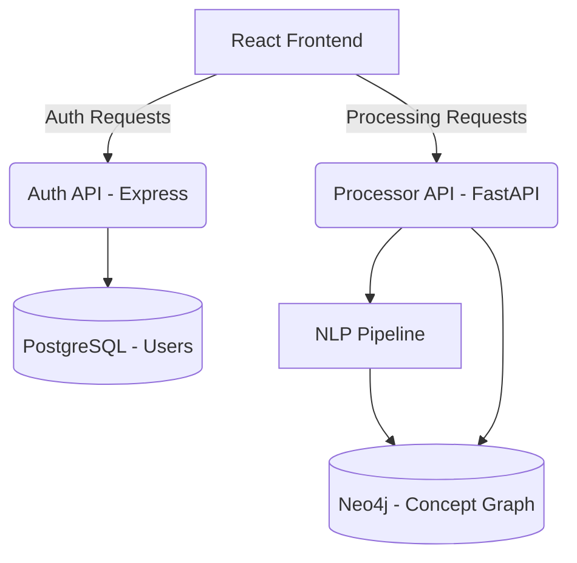

# 🧬 ConceptWeaver

ConceptWeaver is an AI-powered platform that transforms unstructured PDF documents into **hierarchical knowledge graphs**. By combining advanced NLP pipelines with graph-based storage, it allows users to visualize complex information as interactive mind maps.

---

## 🚀 Key Features

-   **Intelligent PDF Parsing**: Extracts structural elements like chapters, sections, and key terms.
-   **Hierarchical Clustering**: Automatically ranks and groups concepts to form a logical mind-map structure.
-   **Interactive Visualization**: D3-powered 2D force-directed graphs for exploring relationships.
-   **Multi-Engine Backend**: Combines FastAPI (Python) for processing and Express (Node.js) for authentication.
-   **Persistent Knowledge**: Stores semantic links and document structures in **Neo4j**.

---

## 🏗️ Architecture



---

## 💻 Tech Stack

| Component | Technology |
| :--- | :--- |
| **Frontend** | React 19, Vite, D3.js, `react-force-graph-2d` |
| **Auth Backend** | Node.js, Express, JWT, Bcrypt |
| **Processor API** | Python 3.10+, FastAPI, Uvicorn |
| **NLP Pipeline** | SpaCy / Transformers, PDFPlumber |
| **Databases** | Neo4j (Graph), PostgreSQL (Relational) |
| **Infrastructure** | Docker, Docker Compose |

---

## 🏁 Getting Started

### Prerequisites

-   [Docker](https://www.docker.com/) & Docker Compose
-   Python 3.10+ (for local development)
-   Node.js 18+ (for local development)

### Quick Start (Docker)

The easiest way to run the entire stack is using Docker Compose:

```bash
docker-compose up --build
```

-   **Frontend**: [http://localhost:5173](http://localhost:5173)
-   **Processor API**: [http://localhost:8000](http://localhost:8000)
-   **Auth API**: [http://localhost:5000](http://localhost:5000)
-   **Neo4j Browser**: [http://localhost:7474](http://localhost:7474) (neo4j/password)

---

## 📂 Project Structure

-   `backend/auth`: Node.js Express service for user management.
-   `backend/processor`: Python FastAPI service for PDF processing and NLP.
-   `frontend`: React application for visualization and user interaction.
-   `docker-compose.yml`: Orchestration for all services and databases.

---

## 📄 License

This project is licensed under the ISC License.
